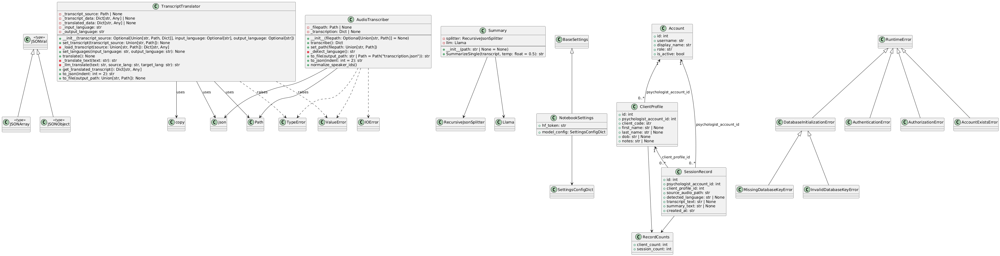

# AudioNotetaker - Project Documentation

**Course:** STAT405 - Advanced Methods in Data Science
**Authors:** Hailey Hanford-Scott, James Donahue, Matthew Eberhart, Minh Nguyen, Andrew Sparkes
**Version:** 0.1.0

---

## Table of Contents

1. [System Architecture](#1-system-architecture)
2. [Feature List & Intended User](#2-feature-list--intended-user)
3. [AI Component Description](#3-ai-component-description)
4. [Data Handling Statement](#4-data-handling-statement)
5. [Known Limitations & Troubleshooting](#5-known-limitations--troubleshooting)
6. [Reproducing the Evaluation](#6-reproducing-the-evaluation)

---

## 1. System Architecture

AudioNotetaker is a **fully local, offline-capable desktop application** built with Python and PySide6 (Qt6). All processing - transcription, summarization, and storage - occurs on-device. No patient data is ever transmitted externally.

### Architecture Diagram



### Component Overview

```
┌─────────────────────────────────────────────────────────┐
│                     PySide6 GUI Layer                   │
│  Login | Upload | Patients | Transcripts | Accounts |   │
│  Patient Detail | Settings                              │
└────────────────────────┬────────────────────────────────┘
                         │
┌────────────────────────▼────────────────────────────────┐
│                   Services Layer                        │
│  session_processing.py - orchestrates the pipeline      │
└──────┬──────────────────────────┬───────────────────────┘
       │                          │
┌──────▼──────────┐    ┌──────────▼──────────────────────┐
│  Audio / AI     │    │        Database Layer            │
│                 │    │                                  │
│ WhisperX        │    │  auth.py   - accounts & login    │
│ (transcription  │    │  records.py - clients & sessions │
│  + diarization) │    │  database.py - SQLCipher conn.   │
│                 │    │                                  │
│ Qwen3-4B (GGUF) │    │  ~/.transcribenotes/db_key.bin   │
│ (summarization) │    │  (DPAPI-wrapped on Windows)      │
└─────────────────┘    └──────────────────────────────────┘
```

### Technology Stack

| Layer | Technology |
|---|---|
| GUI | PySide6 (Qt 6) |
| Transcription | WhisperX + faster-whisper |
| Speaker Diarization | pyannote/speaker-diarization-3.0 |
| Summarization | llama-cpp-python (Qwen3-4B-Q5_0.gguf) |
| Audio Pre-processing | FFmpeg |
| Database | SQLite via SQLCipher (AES-256) |
| Key Management | Windows DPAPI / file mode 0o600 |
| Dependency Management | uv / pyproject.toml |
| Python Version | 3.12+ |

---

## 2. Feature List & Intended User

### Intended User

**Primary user:** Licensed psychologists and mental health clinicians working in **high-security, restricted environments** - such as juvenile detention facilities or correctional mental health units - where cloud connectivity is prohibited and strict data privacy is required.

**Secondary user:** System administrators (clinic IT staff) who provision and manage user accounts.

### Feature List

#### Core Features

| Feature | Description |
|---|---|
| Audio Transcription | Upload an MP4 audio file; the app produces a full speaker-labeled transcript using WhisperX |
| Speaker Diarization | Automatically distinguishes between provider and patient voices in the transcript |
| Session Summarization | Generates a concise clinical summary from the transcript using a local LLM (Qwen3-4B) |
| Multilingual Support | Automatic language detection; configurable default input language (English, Spanish, and others supported by Whisper) |
| Patient Profile Management | Create, view, and manage client profiles with a coded identifier to avoid storing personally identifiable names in plain text |
| Session History | Browse all past sessions for a given patient, view transcripts and summaries |
| Transcript Search | Search and filter across all transcripts |
| Offline Operation | All models run locally; no internet required after initial model download |

#### Security & Administration Features

| Feature | Description |
|---|---|
| Encrypted Database | All stored data protected by AES-256 via SQLCipher |
| Role-Based Access Control | Two roles: Admin (full access) and Psychologist (own data only) |
| Admin Authorization Workflow | New psychologist accounts require explicit approval from an admin |
| Audit Logging | Every login attempt, account creation, and authorization event is recorded with timestamps |
| Secure Deletion | SQLCipher `secure_delete` pragma overwrites deleted database pages |
| Password Security | PBKDF2-HMAC-SHA256 with 600,000 iterations and random per-account salt |

---

## 3. AI Component Description

The application uses two distinct AI models. Both run **entirely on-device** with no prompts, transcripts, or patient data that are sent to any external service.

---

### 3.1 Transcription - WhisperX

**Purpose:** Convert recorded audio sessions to text with speaker labels and timestamps.

**Input:**
- An MP4 audio file provided by the clinician via the upload screen
- Optional: a configured default language (ISO 639-1 code, e.g. `en`, `es`); auto-detects if unset

**Output:**
- A JSON object containing: word-level timestamps, speaker labels (`SPEAKER_00`, `SPEAKER_01`, etc.), and segment text
- A formatted plain-text transcript derived from the JSON

**Model Configuration (`app/src/WhisperXConfig/`):**
- Model sizes available: `tiny`, `base`, `small`, `medium`, `large` (and English-specific variants e.g. `base.en`)
- Auto-detects available GPU; falls back to CPU with appropriate batch sizing and quantization
- Cached to `models_cache/` after first download; fully offline thereafter

**Gated Model Access:**
- Speaker diarization uses `pyannote/speaker-diarization-3.0`, a HuggingFace gated model
- A HuggingFace access token (`HF_TOKEN`) is required **only during the first run** to download the model
- The token is stored in `.env` and is **never used at runtime** after models are cached

**Guardrails:**
- No external API calls at inference time
- Audio file content is not stored in the database; only the file path reference and resulting transcript are persisted
- The model does not retain session-to-session state

---

### 3.2 Summarization - Qwen3-4B (Local LLM)

**Purpose:** Generate a concise, factual, neutral clinical summary from the session transcript.

**Input:**
- The full transcript JSON produced by WhisperX
- Large transcripts are chunked using `RecursiveJsonSplitter` (max chunk: 2,000 tokens, min: 1,000 tokens) to stay within the model's context window

**Output:**
- A plain-prose clinical summary (no bullet points, no lists)
- Chain-of-thought reasoning blocks (`<think>...</think>`) are automatically stripped from the output before it is saved

**Model:**
- `Qwen3-4B-Q5_0.gguf` - a quantized 4-billion parameter model stored locally in `models/`
- Inference engine: `llama-cpp-python` (C++ backend with Python bindings)

**Prompting & Configuration:**

*System prompt:*
```
You are a clinical summarizer. Write concise, factual, neutral clinical summaries
in plain prose. Return plain text only - no bullet points, no numbered lists,
no meta-commentary. /no_think
```

*Inference parameters:*

| Parameter | Value |
|---|---|
| Context window (`n_ctx`) | 8,192 tokens |
| Batch size (`n_batch`) | 2,048 |
| Temperature | 0.5 (configurable) |
| Max output tokens | 512 per chunk / 1,024 for final summary |

**Multi-chunk pipeline:**
1. Transcript JSON is split into chunks
2. Each chunk is summarized independently
3. Partial summaries are concatenated
4. A final pass generates a single cohesive summary

**Guardrails:**
- Model runs entirely locally; no data leaves the device
- `/no_think` directive suppresses chain-of-thought output
- Fallback: if the LLM is unavailable (model file missing, out-of-memory), the app falls back to a simple extractive summary (first N words of the transcript) and logs a warning - the user is not left without output
- The model does not access the internet, file system, or any patient records beyond the transcript passed to it in the prompt
- Output is treated as a draft aid; the clinician is responsible for reviewing and approving the summary before it enters any official record

---

## 4. Data Handling Statement

### What Data Is Stored

| Data Category | Fields Stored |
|---|---|
| User Accounts | Username, display name, role (admin/psychologist), password hash (PBKDF2-SHA256), active status, creation timestamp, last login timestamp |
| Authorization Records | Which admin approved which psychologist account, approval note, timestamp |
| Login Audit Events | Username attempted, associated account ID, event type (login/creation/authorization), success flag, timestamp |
| Client Profiles | Client code (anonymized ID), first name, last name, date of birth, clinical notes, created/updated timestamps - linked to the owning psychologist account |
| Session Records | Source audio file path (reference only), detected language, full transcript text, generated summary text, creation timestamp - linked to the patient and psychologist |

**Audio files are not copied or stored inside the database.** Only a file system path reference is recorded.

### Where Data Is Stored

| Asset | Location |
|---|---|
| Encrypted database | `data/transcribenotes.db` (relative to the application directory) - overridable via `TRANSCRIBENOTES_DB_PATH` in `.env` |
| Database encryption key | `~/.transcribenotes/db_key.bin` on macOS/Linux; `%LOCALAPPDATA%\TranscribeNotes\db_key.bin` on Windows - overridable via `TRANSCRIBENOTES_KEY_FILE` |
| Cached ML models | `models_cache/` (WhisperX, pyannote) and `models/` (Qwen3 GGUF) |
| Application logs | `logs/` directory (stdout mirroring) |

**All data remains on the local machine.** There is no cloud sync, telemetry, or external network communication at runtime.

### Encryption

- **Database encryption:** AES-256 via SQLCipher (cipher compatibility level 4)
- **Key protection:** On Windows, the key file is wrapped using the Windows Data Protection API (DPAPI), binding it to the current OS user account. On macOS/Linux, the key file is stored with permissions `0o600` (owner read/write only)
- **Key generation:** A 48-byte URL-safe random key is generated automatically on first run if no key is present
- **Secure deletion:** SQLCipher `PRAGMA secure_delete = ON` ensures deleted database pages are overwritten with zeros

### Data Retention Assumptions

- **Session records and patient profiles** are retained indefinitely unless manually deleted by the owning psychologist through the application UI
- **Audit logs** are permanent and cannot be deleted through the UI - they exist for compliance and accountability purposes
- **Cascade deletion:** Deleting a patient profile also deletes all associated session records (enforced by a database trigger)
- **No automatic purge or expiry** is implemented in this version
- **No backups** are created automatically; administrators are responsible for backing up `data/transcribenotes.db` and `db_key.bin` separately. Loss of the key file renders the database permanently inaccessible

### Data Access Controls

- Psychologists can only read and write data associated with their own account (enforced by database foreign keys and application-level filtering)
- Admins can manage user accounts but do not have access to another psychologist's patient records through the UI
- All authentication events are recorded in the audit log

---

## 5. Known Limitations & Troubleshooting

### Known Limitations

| Issue | Severity | Category | Description |
|---|---|---|---|
| Context loss in long transcripts | High | AI Quality | For very long sessions, the summarization model tends to weight the end of the session more heavily, potentially losing key information from the beginning |
| Tone neutralization | Medium | AI Quality | The LLM sometimes produces overly neutral language that flattens the emotional intensity of a session, potentially omitting clinically significant nuance |
| Processing latency on CPU | Medium | Performance | Summarizing transcripts of 2,000+ words can take several minutes on machines without a dedicated GPU |
| Diarization gap | Medium | Functional | Speaker diarization integration with the LLM summarization pipeline is incomplete; the model may not reliably distinguish provider vs. patient contributions in the summary |
| Summary length for short sessions | Low | Usability | Summaries for brief check-in sessions can be as long as the transcript itself |
| No automatic database backup | High | Reliability | There is no built-in backup. If the local hard drive fails, all records are lost |
| No shared learning across installations | Low | Functional | As a fully local system, model improvements must be deployed as manual software updates - there is no federated learning or shared improvement mechanism |
| Hardware dependency | Medium | Performance | Transcription and summarization speed are strictly limited by local CPU/GPU. Minimum recommended: 16 GB RAM, Nvidia GPU |

### Troubleshooting

**App fails to start / database cannot be opened**
- Verify that `data/transcribenotes.db` exists and is not open in another program
- Verify that the key file exists at the expected path (`~/.transcribenotes/db_key.bin` or `%LOCALAPPDATA%\TranscribeNotes\db_key.bin`)
- If the key file is missing and the database exists, the database cannot be recovered. Restore from backup

**Transcription fails or hangs**
- Confirm FFmpeg is installed and available on the system `PATH` (must be the shared-libraries build)
- Confirm the audio file is a valid MP4
- On first run, WhisperX downloads models from HuggingFace; ensure `HF_TOKEN` is set in `.env` and the machine has internet access
- For offline use, set `HF_HUB_OFFLINE=1` in `.env` after models are cached

**"HF Token" / gated model error**
- Accept the terms of use for `pyannote/speaker-diarization-3.0` on HuggingFace.co while logged in with the account whose token is in `.env`

**Summarization model not available / fallback used**
- Confirm `models/Qwen3-4B-Q5_0.gguf` (or the configured GGUF file) exists
- If the machine has insufficient RAM to load the model, llama-cpp-python will fail silently; the app falls back to an extractive summary and logs a warning to `logs/`

**Login fails for admin account**
- The default admin account is `admin`. If the password was changed and is unknown, there is no recovery path without direct database access

**New psychologist account cannot log in**
- Psychologist accounts require explicit admin authorization before they become active. Log in as admin and navigate to the Accounts page to authorize the pending account

**Models re-downloading on every run**
- Confirm `CACHED_MODEL_DIR=models_cache/` is set in `.env`. Without this, HuggingFace datasets will use the default OS cache path, which may differ between runs

---

## 6. Reproducing the Evaluation

The full testing methodology and results are documented in:

**[Evaluation Report Audio to Text Transcription and Note Takin (1).docx](Evaluation%20Report%20Audio%20to%20Text%20Transcription%20and%20Note%20Takin%20%281%29.docx)**

### Summary of Evaluation Approach

Testing covered four requirement areas mapped from the SRS:

| Requirement | Test ID | Description |
|---|---|---|
| SRS 1.2 - Local Processing | T-OFF-01 | Verify transcription functions with all network adapters disabled |
| SRS 2.1 - Confidentiality | T-SEC-01 | Attempt to open `.db` or audio files using external editors/media players |
| SRS 2.3 - Usability | T-USE-01 | Measure "Time to Success" for a first-time user importing an MP4 |
| SRS 2.4 - Efficiency | T-PERF-01 | Benchmark processing duration for a 10-minute audio file |

### LLM Summarization Evaluation

**Framework:** [DeepEval](https://github.com/confident-ai/deepeval) - an LLM-as-judge evaluation framework
**Dataset:** 8 synthetic clinical transcripts, varying in length, topic, and emotional intensity
**Generation:** Transcripts were AI-generated to simulate diarized output across diverse clinical scenarios (intake, crisis intervention, routine check-in)

**Metrics and scores (averaged across 8 transcripts):**

| Metric | Score | Definition |
|---|---|---|
| Relevancy | **0.91** | Alignment between input transcript and generated summary - no drift |
| Hallucination | **0.90** | Factual consistency - model did not introduce information not in the source |
| Professionalism | **0.81** | Appropriate clinical language and tone |
| Accuracy | **0.81** | Critical clinical details from the transcript appear in the summary |
| Tone | **0.78** | Model does not exaggerate or flatten the patient's emotional state |

**Human alignment check:** The Professionalism metric was manually audited on a 3-transcript subset to verify that the AI judge's scores aligned with clinical expectations.

### To Reproduce

1. Install dependencies per the [README](README.md)
2. Install DeepEval: `uv add deepeval` (or `pip install deepeval`)
3. Place test transcripts in `app/lm/testing/`
4. Run the summarizer against each test transcript via `app/lm/Summarizer.py`
5. Use DeepEval's test case API to score outputs against the five metrics defined above
6. Compare average scores to the baseline table above

> **Note:** Because the transcription-to-LLM pipeline was not fully integrated at time of evaluation, testing was conducted by feeding synthetic transcripts directly into the summarizer. A complete end-to-end evaluation (audio → transcript → summary → score) is recommended as a next step.
